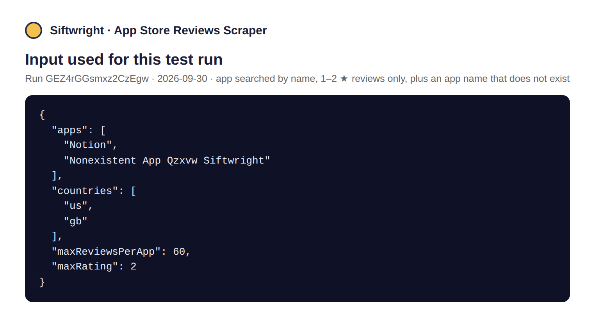
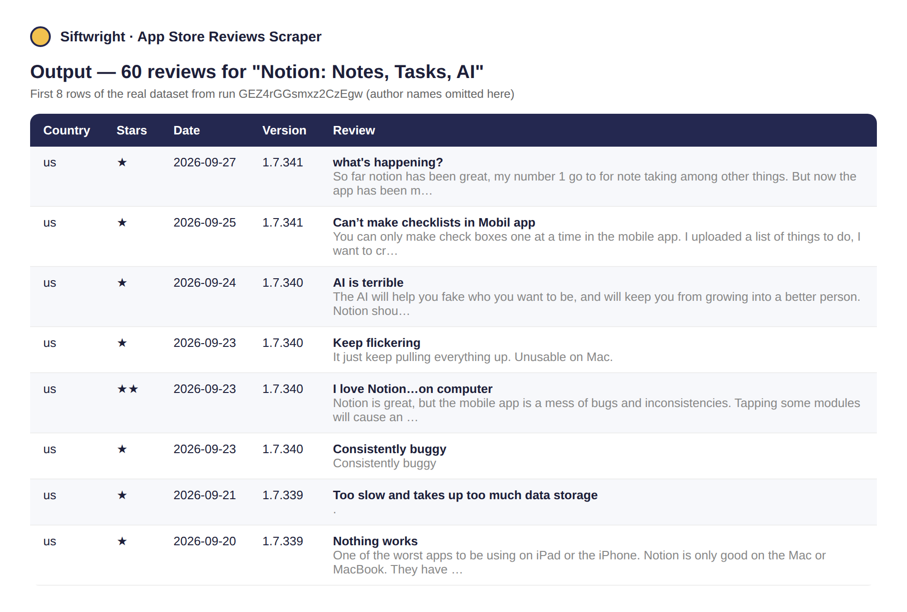
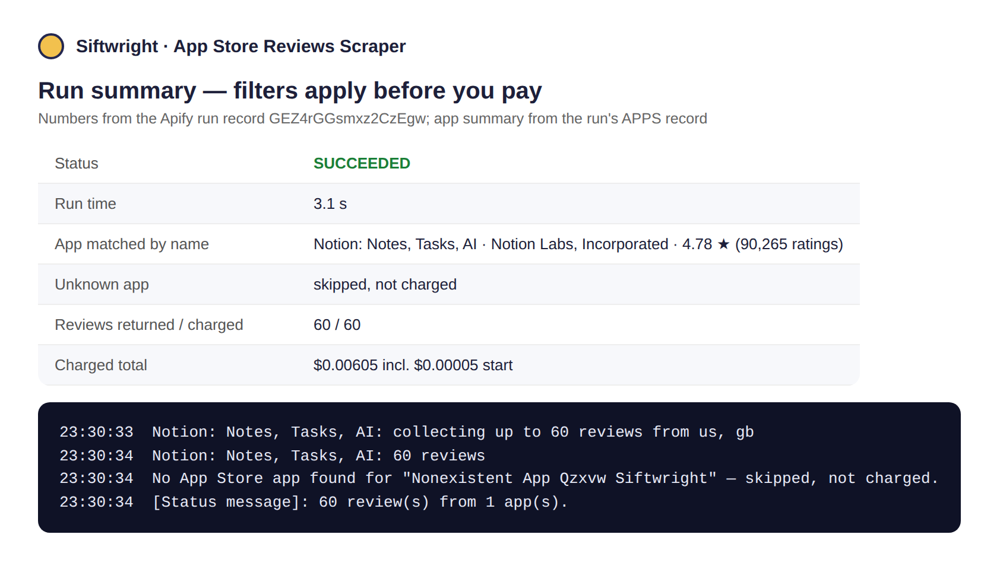

# App Store Reviews Scraper

**▶ [Run it on Apify](https://apify.com/siftwright/app-store-reviews-scraper)** · Examples: [Python, JavaScript & curl](examples/) · Product page: [siftwright.com/app-store-reviews-scraper/](https://siftwright.com/app-store-reviews-scraper/)

Get **Apple App Store reviews** for any iPhone/iPad app — star rating, title, full text, author, date and the app version reviewed. Paste an App Store link, an app id, or **just the app's name**, pick one or many countries, and download the results as JSON, CSV or Excel.

**Price: $0.10 per 1,000 reviews ($0.0001 each).** Reviews removed by your filters, duplicates, and apps that can't be found are **never charged**.





*Screenshots are rendered from a real test run on 2026-09-30 (run input, dataset and run record), not mock-ups.*

## Why use this scraper

| | |
|---|---|
| 💵 **Price** | **$0.10 per 1,000 reviews**, no monthly rental |
| 🔎 **Search by name** | Type `Duolingo` — no need to hunt for the app id |
| 🌍 **Many countries in one run** | Every App Store country has its own reviews; list `us, gb, ca, au, de…` and get them all, de-duplicated |
| ⭐ **Filter before you pay** | By stars (e.g. 1–2 ★ complaints only), keywords, or date — you only pay for what you keep |
| 🔁 **Retries Apple's empty pages** | Apple's public review feed often answers with an empty page even when reviews exist; the scraper retries until it gets the real page instead of silently returning fewer reviews |
| ⚡ **Fast and light** | Plain HTTPS, no browser and no proxy. ~470 reviews from 3 apps in 2 countries took 19 seconds in testing |
| 🤖 **AI-agent ready** | Callable from Claude, ChatGPT & Cursor through Apify's MCP server |

## What you can use it for

- 🐞 **Bug & complaint mining** — pull every 1–2 ★ review mentioning "crash" or "login" after a release.
- 🥊 **Competitor research** — see what users love and hate about competing apps, country by country.
- 📊 **Sentiment dashboards** — feed fresh reviews into a spreadsheet, BI tool or LLM on a schedule.
- 🧪 **Release monitoring** — compare reviews by `appVersionReviewed` to see how a new version landed.

## How to use

1. Click **Try for free**.
2. Add one or more apps (name, App Store link or id) and the countries you care about.
3. Optionally set star, keyword or date filters.
4. Click **Start** and download the results from the **Output** tab.

## Input example

```json
{
  "apps": ["Duolingo", "https://apps.apple.com/us/app/facebook/id284882215"],
  "countries": ["us", "gb"],
  "maxReviewsPerApp": 200,
  "maxRating": 2
}
```

| Field | Description |
|---|---|
| `apps` | App Store URLs, numeric app ids, or app names |
| `countries` | Two-letter App Store country codes (default `us`) |
| `maxReviewsPerApp` | Stop after this many reviews per app, across all countries (default 500) |
| `sortBy` | `mostrecent` (default) or `mosthelpful` |
| `minRating` / `maxRating` | Keep only reviews within this star range |
| `keywords` | Keep only reviews containing at least one of these words |
| `since` | Keep only reviews posted on or after this date |

## Output example

A real row from a test run:

```json
{
  "reviewId": "14607611788",
  "appId": "570060128",
  "appName": "Duolingo: Language Lessons",
  "country": "us",
  "rating": 1,
  "title": "Lightning bolt animation",
  "text": "Please remove the lightning bolt animation from stories, it is very jarring and unhealthy for the eyes.",
  "author": "Language Learner 7",
  "authorUrl": "https://itunes.apple.com/us/reviews/id36789391",
  "appVersionReviewed": "7.142.0",
  "date": "2026-09-29T15:41:58.000Z",
  "helpfulVotes": 0,
  "totalVotes": 0,
  "developer": "Duolingo, Inc",
  "appUrl": "https://apps.apple.com/us/app/duolingo-language-lessons/id570060128"
}
```

A summary of every app (matched name, developer, overall rating, rating count, current version, genre and number of reviews collected) is saved to the run's key-value store as `APPS`.

## Limits you should know about

Apple's public review feed returns **up to 500 reviews per app, per country, per sort order** (the most recent or most helpful ones). To collect more, add more countries. Older reviews beyond that window are not available through this feed. Developer replies are not included in the feed.

## Pricing

Pay-per-event: **$0.0001 per review returned** (= $0.10 per 1,000), plus Apify's standard $0.00005 Actor start fee. Filtered-out reviews, duplicates and apps that can't be found are free. Apify's free plan includes monthly credits, so you can try it at no cost.

## Quick start in Python

```python
from apify_client import ApifyClient

client = ApifyClient("YOUR_APIFY_TOKEN")
run = client.actor("siftwright/app-store-reviews-scraper").call(run_input={
    "apps": ["Duolingo"],
    "countries": ["us", "gb", "ca"],
    "maxRating": 2,
})
# apify-client 3.x (pip install apify-client); on 2.x use run["defaultDatasetId"]
for item in client.dataset(run.default_dataset_id).iterate_items():
    print(item["country"], item["rating"], item["title"])
```

## Use it via API

```bash
curl -X POST "https://api.apify.com/v2/acts/siftwright~app-store-reviews-scraper/run-sync-get-dataset-items?token=YOUR_TOKEN" \
  -H "Content-Type: application/json" \
  -d '{"apps":["Duolingo"],"countries":["us"],"maxReviewsPerApp":100}'
```

Works with Python and JavaScript API clients, Make, Zapier, n8n, LangChain and LlamaIndex. **AI agents** (Claude, ChatGPT, Cursor) can call it directly through [Apify's MCP server](https://mcp.apify.com).

## FAQ

**Where does the data come from?** Apple's own public customer-review feed for each App Store country — the same reviews anyone can read on the App Store.

**The app name matched the wrong app.** Name search uses Apple's App Store search and takes the top result. For an exact match, paste the App Store link or app id instead.

**Is it legal?** The scraper only reads publicly available reviews. Make sure your use respects Apple's terms and applicable data-protection law (e.g. GDPR/CCPA), especially if you store reviewer names.

**Something broke or you need a feature?** Open an issue [in this repo](../../../issues) or on the Apify **Issues** tab, or email support@siftwright.com — we respond fast.
