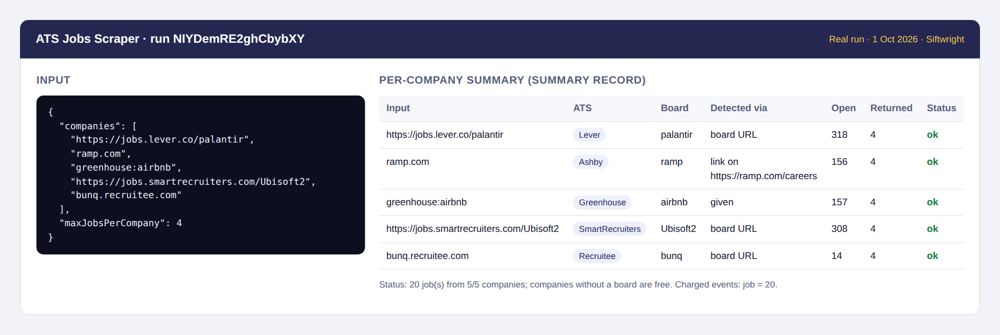
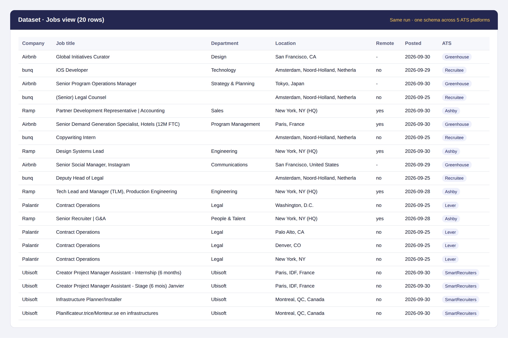
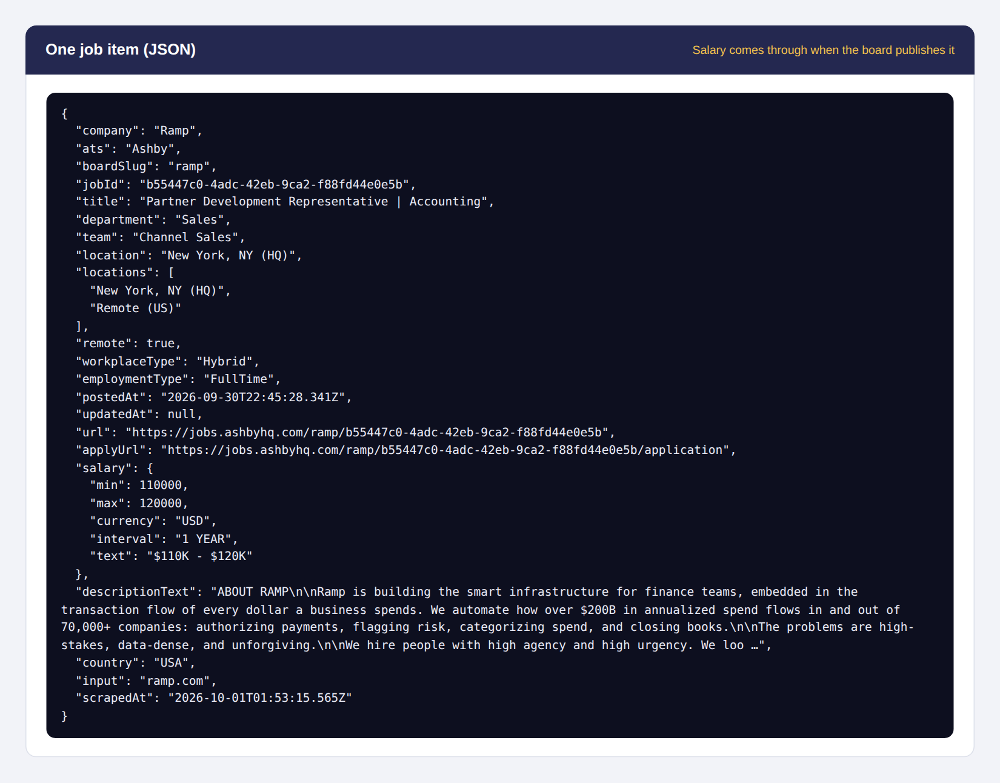

# ATS Jobs Scraper – Greenhouse, Lever, Ashby, SmartRecruiters & Recruitee

**▶ [Run it on Apify](https://apify.com/siftwright/ats-jobs-scraper)** · Examples: [Python, JavaScript & curl](examples/) · Product page: [siftwright.com/ats-jobs-scraper/](https://siftwright.com/ats-jobs-scraper/)

Get **every open job straight from a company's own career board**, in **one clean schema**, no matter which applicant tracking system (ATS) the company uses. Supported: **Greenhouse, Lever, Ashby, SmartRecruiters and Recruitee**.

Give it job-board URLs, **company websites** (the careers page is checked for a board link) or just **company names**. Filter by job title, location, department, remote and posting date — **you only pay for jobs that pass your filters**.

**Price: $1 per 1,000 jobs ($0.001 each).** Companies without a supported board, empty boards and filtered-out jobs are **free**.





*Screenshots are rendered from a real run on 2026-10-01 (run input, SUMMARY record and dataset), not mock-ups.*

## Why use this scraper

| | |
|---|---|
| 💵 **Price** | **$1 per 1,000 jobs**, no monthly rental (plus Apify's tiny per-run start fee) |
| 🎯 **Filter before you pay** | Title keywords, excluded words, location, department, remote-only and "posted in the last N days" are applied **before** charging |
| 🧭 **Auto-detects the ATS** | Paste `ramp.com` and it finds `jobs.ashbyhq.com/ramp` from the careers page; paste `Figma` and it tries the common board names |
| 🧱 **One schema for 5 platforms** | Same fields for every job: title, department, team, location(s), remote, workplace type, employment type, posted date, URL, apply URL, salary, description |
| 💰 **Salary when published** | Ashby, Lever and Recruitee salary ranges come through as numbers (min, max, currency, interval) |
| 📋 **Per-company summary** | A `SUMMARY` record shows which board was found, how, and how many jobs were open, matched and returned |
| 🤖 **AI-agent ready** | Callable from Claude, ChatGPT & Cursor through Apify's MCP server |

Data comes from each ATS's **public job-board API** (the same feed the company's careers page uses), so it is current at run time and there are no proxies or logins involved.

## What you can use it for

- 📈 **Sales signals** – companies hiring "Head of Data" or "Salesforce Admin" are telling you what they are buying next.
- 🧑‍💼 **Recruiting & sourcing** – watch competitors' openings, or build a niche job board from a list of companies.
- 🏢 **Market and competitor research** – hiring by department and location shows where a company is investing.
- 🧠 **AI agents & RAG** – fresh, structured job data with plain-text descriptions, ready for an LLM.

## How to use

1. Click **Try for free**.
2. Add companies: board URLs, websites, names or `ats:board` (e.g. `greenhouse:airbnb`).
3. Optionally add filters, then click **Start**. Download results from the **Output** tab as JSON, CSV or Excel.

## Input example

```json
{
  "companies": ["https://jobs.lever.co/palantir", "ramp.com", "greenhouse:airbnb", "Figma"],
  "titleKeywords": ["engineer"],
  "excludeTitleKeywords": ["senior", "staff", "manager"],
  "locations": ["New York", "Remote"],
  "postedWithinDays": 60
}
```

| Field | Description |
|---|---|
| `companies` | Board URLs, company websites, company names or `ats:board` |
| `titleKeywords` / `excludeTitleKeywords` | Keep jobs whose title contains any of these / drop jobs containing any of these (case-insensitive) |
| `locations` | Keep jobs whose location, extra locations, country or workplace type contains any of these |
| `departments` | Keep jobs whose department or team contains any of these |
| `remoteOnly` | Only jobs marked remote |
| `postedWithinDays` | Only jobs first published in the last N days (0 = any) |
| `maxJobsPerCompany` | Newest first; 0 = no limit |
| `includeDescription` | Full description as plain text (default `true`, same price) |

## Output example

A real item from a run on 2026-10-01 (description shortened):

```json
{
  "company": "Ramp",
  "ats": "Ashby",
  "boardSlug": "ramp",
  "jobId": "b55447c0-4adc-42eb-9ca2-f88fd44e0e5b",
  "title": "Partner Development Representative | Accounting",
  "department": "Sales",
  "team": "Channel Sales",
  "location": "New York, NY (HQ)",
  "locations": [
    "New York, NY (HQ)",
    "Remote (US)"
  ],
  "remote": true,
  "workplaceType": "Hybrid",
  "employmentType": "FullTime",
  "postedAt": "2026-09-30T22:45:28.341Z",
  "updatedAt": null,
  "url": "https://jobs.ashbyhq.com/ramp/b55447c0-4adc-42eb-9ca2-f88fd44e0e5b",
  "applyUrl": "https://jobs.ashbyhq.com/ramp/b55447c0-4adc-42eb-9ca2-f88fd44e0e5b/application",
  "salary": {
    "min": 110000,
    "max": 120000,
    "currency": "USD",
    "interval": "1 YEAR",
    "text": "$110K - $120K"
  },
  "descriptionText": "ABOUT RAMP\n\nRamp is building the smart infrastructure for finance teams, embedded in the transaction flow of every dollar a business spends. We automate how ove…",
  "country": "USA",
  "input": "ramp.com",
  "scrapedAt": "2026-10-01T01:53:15.565Z"
}
```

Also saved: a `SUMMARY` record in the run's key-value store with one entry per input (`status`, `ats`, `boardSlug`, `detectedVia`, `jobsOnBoard`, `jobsMatched`, `jobsReturned`, `error`).

## Test results

From real runs on 2026-10-01: 5 companies on 5 different platforms → 20 jobs, 20 charged. With filters (engineer, not senior/staff/manager, New York or Remote, last 60 days) on 5 companies → 39 jobs, 0 filter violations, 39 charged. Three inputs with no board (dead domain, made-up board names) → 0 jobs, **$0 charged**. A run with a $0.0035 maximum cost stopped at exactly 3 jobs.

## Limits you should know about

- **Five ATS platforms only.** Companies on Workday, iCIMS, Taleo, Workable, Personio or their own custom system are reported as "not found" in `SUMMARY` and cost nothing.
- **Name guessing can pick the wrong board.** When you give a name or a website without a board link, common board names are tried (e.g. `stripe` on Greenhouse). `detectedVia` says when this happened; give the board URL for certainty.
- Fields depend on what each company fills in: not every board publishes salary, department or employment type, so those can be `null`. Greenhouse has no salary field.
- `postedAt` is the platform's publish date (Lever: created date). Some companies repost jobs, which resets it.
- Open jobs only; there is no history of closed jobs.

## Pricing

Pay-per-event: **$0.001 per job returned** (= $1 per 1,000). Inputs without a board and jobs removed by your filters are free, and runs respect your *maximum cost per run* exactly. Apify's free plan includes monthly credits, so you can try it at no cost.

## Quick start in Python

```python
from apify_client import ApifyClient

client = ApifyClient("YOUR_APIFY_TOKEN")
run = client.actor("siftwright/ats-jobs-scraper").call(run_input={
    "companies": ["ramp.com", "https://jobs.lever.co/palantir"],
    "titleKeywords": ["engineer"],
})
# apify-client 3.x (pip install apify-client); on 2.x use run["defaultDatasetId"]
for job in client.dataset(run.default_dataset_id).iterate_items():
    print(job["company"], "|", job["title"], "|", job["location"], "|", job["url"])
```

## Use it via API

```bash
curl -X POST "https://api.apify.com/v2/acts/siftwright~ats-jobs-scraper/run-sync-get-dataset-items?token=YOUR_TOKEN" \
  -H "Content-Type: application/json" \
  -d '{"companies":["greenhouse:airbnb"],"titleKeywords":["data"],"includeDescription":false}'
```

Works with Python and JavaScript API clients, Make, Zapier, n8n, LangChain and LlamaIndex. **AI agents** (Claude, ChatGPT, Cursor) can call it through [Apify's MCP server](https://mcp.apify.com): `https://mcp.apify.com?tools=siftwright/ats-jobs-scraper`.

## FAQ

**Which ATS does a company use?** You don't need to know. Give the website and the scraper checks the careers page for a Greenhouse, Lever, Ashby, SmartRecruiters or Recruitee link; the `SUMMARY` record tells you what it found.

**Why do I pay per job and not per company?** So that small, filtered searches stay cheap. If you only want product-manager roles in London, you pay only for those.

**Can I monitor companies daily?** Yes: save the input as a task, schedule it, and use `postedWithinDays: 1` to get only new postings.

**Is it legal?** It reads public job-board feeds that companies publish so their openings can be found. Use the data in line with applicable law and the boards' terms.

**Something broke or you need another ATS?** Open an issue on the **Issues** tab or email support@siftwright.com.
