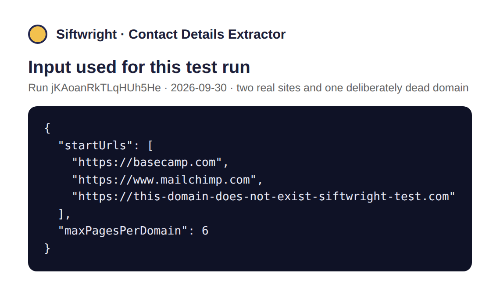
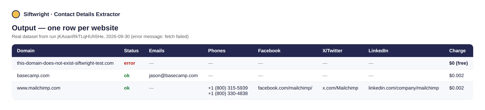
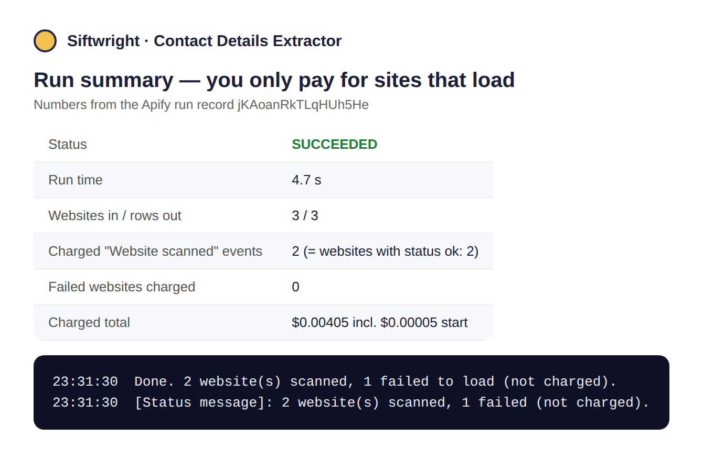

# Contact Details Extractor

**▶ [Run it on Apify](https://apify.com/siftwright/contact-details-extractor)** · Examples: [Python, JavaScript & curl](examples/) · Product page: [siftwright.com/contact-details-extractor/](https://siftwright.com/contact-details-extractor/)

Turn a list of **company websites** into **emails, phone numbers and social profile links** — pulled straight from each site's own pages. Paste a homepage URL and the Actor finds and checks the contact/about pages itself; you don't need to know the exact page.

**Price: $2 per 1,000 websites ($0.002 each).** You only pay for websites that actually load — timeouts, DNS failures and dead domains are **free**.





*Screenshots are rendered from a real test run on 2026-09-30 (run input, dataset and run record), not mock-ups.*

## Why teams choose this extractor

| | This Actor |
|---|---|
| 💵 **Price** | **$2 per 1,000 websites**, no monthly rental |
| 🛡️ **Pay only for success** | Websites that fail to load cost **$0** |
| 🔎 **Self-discovering** | Finds contact/about pages on its own — one homepage URL is enough |
| 📇 **More than emails** | Emails, phone numbers, Facebook, X/Twitter, LinkedIn, Instagram and YouTube in one run |
| ✅ **Verified social links** | Read from structured data and the site's own header/footer/nav — not an unscoped page-wide guess |
| ⚡ **No proxy needed** | Plain HTTP, works on Apify's Free plan |
| 🤖 **AI-agent ready** | Callable from Claude, ChatGPT & Cursor through Apify's MCP server |

## What you can use it for

- 📈 **Sales & lead generation** – build a contact list from a list of prospect company websites.
- 🤝 **Partnership & outreach research** – find the right public channel to reach a company on.
- 🧹 **CRM enrichment** – fill in missing emails, phones and social links for existing accounts.
- 🕵️ **Due diligence** – quickly see how (and whether) a company presents itself publicly.

## Features

- ✅ Give it just a homepage — it discovers `/contact`, `/about`, `/support` and similar pages itself
- ✅ Extracts **emails** (visible text + `mailto:` links) and filters out placeholder addresses like `info@example.com`
- ✅ Extracts **phone numbers** (visible text + `tel:` links)
- ✅ Extracts **Facebook, X/Twitter, LinkedIn, Instagram, YouTube** links from schema.org structured data and the site's header/footer/nav
- ✅ Configurable crawl depth per domain (`maxPagesPerDomain`)
- ✅ Runs many websites in parallel
- ✅ Websites that fail to load are reported with the reason and never charged

## How to use

1. Click **Try for free**.
2. Paste one or more company homepage URLs into **Websites**.
3. Click **Start** and download the results from the **Output** tab.

## Input example

```json
{
  "startUrls": [
    "https://stripe.com",
    "https://www.shopify.com",
    "https://www.mailchimp.com"
  ],
  "maxPagesPerDomain": 6
}
```

| Field | Description |
|---|---|
| `startUrls` | Company websites to scan — a homepage URL is enough |
| `maxPagesPerDomain` | How many pages to check per website (default 6). Doesn't affect price. |
| `requestTimeoutSecs` | Per-page timeout in seconds (default 15) |
| `maxConcurrency` | How many websites to process at once (default 5) |

## Output example

A real row from a test run on 2026-09-30:

```json
{
  "domain": "www.mailchimp.com",
  "url": "https://www.mailchimp.com",
  "status": "ok",
  "emails": [],
  "phones": ["+1 (800) 315-5939", "+1 (800) 330-4838"],
  "facebook": "https://www.facebook.com/mailchimp/",
  "twitter": "https://x.com/Mailchimp",
  "linkedin": "https://www.linkedin.com/company/mailchimp",
  "instagram": "https://www.instagram.com/mailchimp/",
  "youtube": null,
  "pagesScanned": 6
}
```

The same phone number found as a `tel:` link and as visible text is returned once, in its most readable form.

Websites that fail to load are returned with `"status": "error"` and an `error` message, and are **not charged**.

## Limits you should know about

- It reads **plain HTML** without a browser. Sites that only render contact details with JavaScript, behind a login or behind a bot wall (e.g. Cloudflare challenges) may come back with fewer or no results — they are still charged if the homepage loaded, because the scan itself ran.
- Many large companies publish **no email address at all** (only contact forms); an empty `emails` list is a real answer, not an error.
- Only public pages on the same domain are scanned (up to `maxPagesPerDomain`, default 6). It does not search Google, LinkedIn or other third-party sources, and it does not guess or verify emails.
- Phone numbers are matched only when written in a phone-like format (a leading `+` or an area code in brackets) or linked with `tel:`, to avoid picking up random digits.

## Pricing

Pay-per-event: **$0.002 per successfully scanned website** (= $2 per 1,000). No monthly rental, no charge for websites that fail to load. Apify's free plan gives you monthly credits so you can try it for free.

## Quick start in Python

```python
from apify_client import ApifyClient

client = ApifyClient("YOUR_APIFY_TOKEN")
run = client.actor("siftwright/contact-details-extractor").call(run_input={
    "startUrls": ["https://stripe.com", "https://www.shopify.com"],
})
# apify-client 3.x (pip install apify-client); on 2.x use run["defaultDatasetId"]
for item in client.dataset(run.default_dataset_id).iterate_items():
    print(item["domain"], item["emails"], item["phones"])
```

## Use it via API

```bash
curl -X POST "https://api.apify.com/v2/acts/siftwright~contact-details-extractor/run-sync-get-dataset-items?token=YOUR_TOKEN" \
  -H "Content-Type: application/json" \
  -d '{"startUrls":["https://stripe.com","https://www.shopify.com"]}'
```

Works with Python and JavaScript API clients, Make, Zapier, n8n, LangChain and LlamaIndex. **AI agents** (Claude, ChatGPT, Cursor) can call it directly through [Apify's MCP server](https://mcp.apify.com).

## FAQ

**Does it guess or verify emails?** It only returns addresses and numbers that are actually published on the website's own pages — it does not guess, generate or verify deliverability.

**Can results ever include a name that isn't the target company?** Rarely — a page that embeds a customer case study or testimonial widget can occasionally surface that third party's own details alongside the target site's. Social links are checked against structured data and the site's own header/footer/nav to keep this rare; always spot-check results before using them for compliance-sensitive work.

**Is it legal?** The Actor only reads publicly available pages, the same way a browser would. Make sure your use (e.g. outreach) respects the target sites' terms and applicable data-protection law (e.g. GDPR/CCPA) in your jurisdiction.

**Something broke or you need a feature?** Open an issue [in this repo](../../../issues) or on the Apify **Issues** tab, or email support@siftwright.com — we respond fast.
