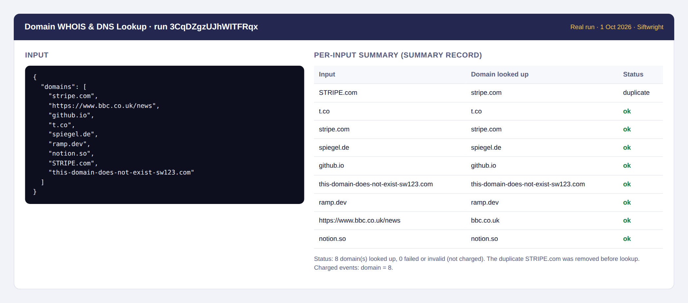
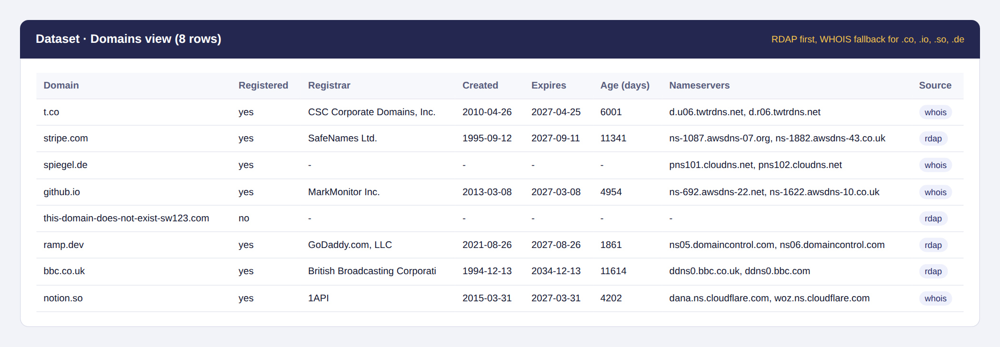
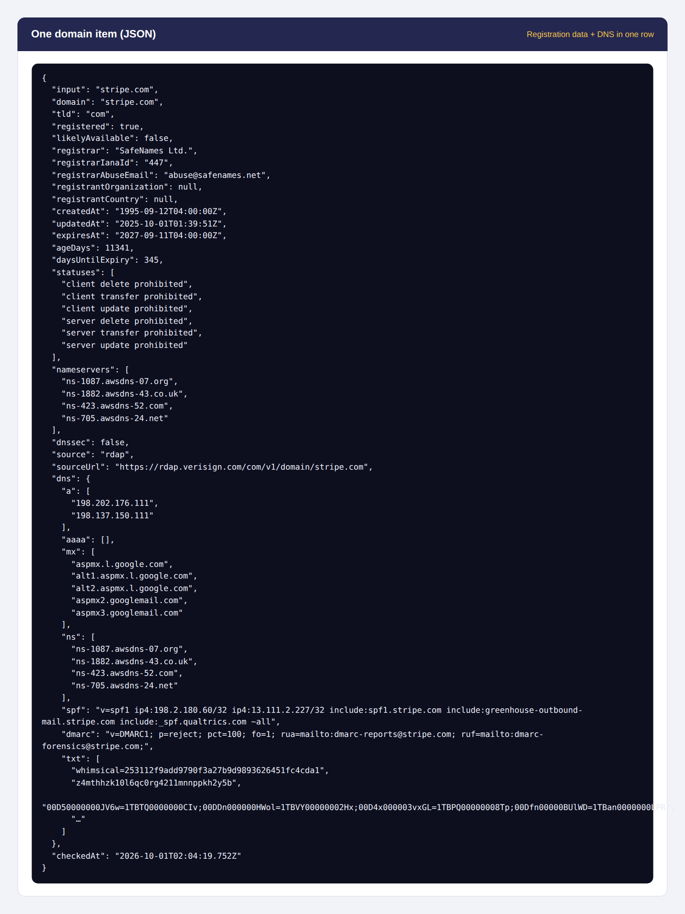

# Domain WHOIS & DNS Lookup – Bulk RDAP, Age, Expiry

**▶ [Run it on Apify](https://apify.com/siftwright/domain-whois-dns-lookup)** · Examples: [Python, JavaScript & curl](examples/) · Product page: [siftwright.com/domain-whois-lookup/](https://siftwright.com/domain-whois-lookup/)

Look up **who registered a domain, when, until when, and how it's set up**, for a whole list at once. Each domain comes back as one clean JSON row: **registrar, creation date, expiry date, domain age, days until expiry, status codes, nameservers, DNSSEC**, plus **DNS records** (A, AAAA, MX, NS, SPF, DMARC, TXT).

Registration data comes from the official **RDAP** service of each registry (the modern, structured replacement for WHOIS). For popular TLDs without RDAP, like **.io, .co, .so and .de**, it falls back to the registry's classic **WHOIS** server automatically.

**Price: $1 per 1,000 domains ($0.001 each).** Invalid inputs, duplicates and failed lookups are **free**.





*Screenshots are rendered from a real run on 2026-10-01 (run input, SUMMARY record and dataset), not mock-ups.*

## Why use this lookup

| | |
|---|---|
| 💵 **Price** | **$1 per 1,000 domains**, no monthly rental (plus Apify's tiny per-run start fee) |
| 🛡️ **Pay only for answers** | Invalid inputs, duplicates, unsupported TLDs and failed lookups cost **$0** |
| 🏛️ **Official sources** | RDAP from the registry (IANA bootstrap), WHOIS fallback for .io, .co, .so, .de, .me, .tv and more |
| 📆 **Ready-made numbers** | `ageDays` and `daysUntilExpiry` computed for you, ISO 8601 dates |
| 📬 **DNS & email setup included** | A/AAAA, MX, NS, SPF, DMARC and TXT records at no extra charge |
| 🔎 **Availability hint** | Unregistered domains come back with `registered: false` / `likelyAvailable: true` |
| 🧹 **Accepts messy input** | URLs, subdomains and mixed case are reduced to the registrable domain (`https://www.bbc.co.uk/news` → `bbc.co.uk`) |
| 🤖 **AI-agent ready** | Callable from Claude, ChatGPT & Cursor through Apify's MCP server |

## What you can use it for

- 🛡️ **Security & brand protection** – spot newly registered look-alike domains (low `ageDays`) and check their registrar and nameservers.
- 🧾 **Portfolio management** – find domains expiring in the next 30 days across all your registrars.
- 🎯 **Lead qualification** – domain age is a quick trust signal; MX tells you Google Workspace vs Microsoft 365.
- 📧 **Email deliverability audits** – which domains lack SPF or DMARC.
- 🔍 **Domain research** – check whether names on a shortlist are registered.

## How to use

1. Click **Try for free**.
2. Paste domains or URLs into **Domains**.
3. Click **Start** and download the results from the **Output** tab as JSON, CSV or Excel.

## Input example

```json
{
  "domains": ["stripe.com", "https://www.bbc.co.uk/news", "github.io", "spiegel.de"],
  "includeDns": true
}
```

| Field | Description |
|---|---|
| `domains` | Domains or URLs; reduced to the registrable domain, duplicates removed |
| `includeDns` | Add DNS records for registered domains (default `true`, no extra charge) |
| `maxConcurrency` | Domains looked up in parallel (default 5; registries rate-limit) |
| `timeoutSecs` | Per-lookup timeout, 5–60 seconds (default 15) |

## Output example

A real item from a run on 2026-10-01 (TXT records shortened):

```json
{
  "input": "stripe.com",
  "domain": "stripe.com",
  "tld": "com",
  "registered": true,
  "likelyAvailable": false,
  "registrar": "SafeNames Ltd.",
  "registrarIanaId": "447",
  "registrarAbuseEmail": "abuse@safenames.net",
  "registrantOrganization": null,
  "registrantCountry": null,
  "createdAt": "1995-09-12T04:00:00Z",
  "updatedAt": "2025-10-01T01:39:51Z",
  "expiresAt": "2027-09-11T04:00:00Z",
  "ageDays": 11341,
  "daysUntilExpiry": 345,
  "statuses": [
    "client delete prohibited",
    "client transfer prohibited",
    "client update prohibited",
    "server delete prohibited",
    "server transfer prohibited",
    "server update prohibited"
  ],
  "nameservers": [
    "ns-1087.awsdns-07.org",
    "ns-1882.awsdns-43.co.uk",
    "ns-423.awsdns-52.com",
    "ns-705.awsdns-24.net"
  ],
  "dnssec": false,
  "source": "rdap",
  "sourceUrl": "https://rdap.verisign.com/com/v1/domain/stripe.com",
  "dns": {
    "a": [
      "198.202.176.111",
      "198.137.150.111"
    ],
    "aaaa": [],
    "mx": [
      "aspmx.l.google.com",
      "alt1.aspmx.l.google.com",
      "alt2.aspmx.l.google.com",
      "aspmx2.googlemail.com",
      "aspmx3.googlemail.com"
    ],
    "ns": [
      "ns-1087.awsdns-07.org",
      "ns-1882.awsdns-43.co.uk",
      "ns-423.awsdns-52.com",
      "ns-705.awsdns-24.net"
    ],
    "spf": "v=spf1 ip4:198.2.180.60/32 ip4:13.111.2.227/32 include:spf1.stripe.com include:greenhouse-outbound-mail.stripe.com include:_spf.qualtrics.com ~all",
    "dmarc": "v=DMARC1; p=reject; pct=100; fo=1; rua=mailto:dmarc-reports@stripe.com; ruf=mailto:dmarc-forensics@stripe.com;",
    "txt": [
      "whimsical=253112f9add9790f3a27b9d9893626451fc4cda1",
      "z4mthhzk10l6qc0rg4211mnnppkh2y5b"
    ]
  },
  "checkedAt": "2026-10-01T02:04:19.752Z"
}
```

Also saved: a `SUMMARY` record in the run's key-value store with the status of every input (`ok`, `duplicate`, `invalid` or `error` with the reason).

## Test results

Real runs on 2026-10-01: 9 inputs (8 domains + 1 duplicate) across .com, .co.uk, .io, .co, .de, .dev, .so → 8 rows, 8 charged, about 4 seconds. Three invalid inputs → 0 rows, **$0**. A run with a $0.0025 maximum cost stopped at exactly 2 domains.

## Limits you should know about

- **Registrant names and emails are usually redacted** (GDPR and registrar privacy). `registrantOrganization` is filled only when the registry publishes it.
- **Some registries publish very little.** .de (DENIC) gives nameservers, status and last-changed date but no creation or expiry date; a few ccTLDs have neither RDAP nor public WHOIS and are reported as errors, for free.
- `likelyAvailable` means the registry has no record. Premium, reserved or blocked names can still be unavailable to register.
- Registrable-domain detection uses a built-in list of common second-level suffixes (co.uk, com.au, co.jp…); rare ones may need the exact domain.
- Registries rate-limit heavy use; very large lists run more reliably with modest concurrency.

## Pricing

Pay-per-event: **$0.001 per domain looked up** (= $1 per 1,000), registered or not. Invalid inputs, duplicates and failed lookups are free, and runs respect your *maximum cost per run* exactly. Apify's free plan includes monthly credits, so you can try it at no cost.

## Quick start in Python

```python
from apify_client import ApifyClient

client = ApifyClient("YOUR_APIFY_TOKEN")
run = client.actor("siftwright/domain-whois-dns-lookup").call(run_input={
    "domains": ["stripe.com", "github.io", "bbc.co.uk"],
})
# apify-client 3.x (pip install apify-client); on 2.x use run["defaultDatasetId"]
for d in client.dataset(run.default_dataset_id).iterate_items():
    print(d["domain"], d["registrar"], d["createdAt"], d["daysUntilExpiry"])
```

## Use it via API

```bash
curl -X POST "https://api.apify.com/v2/acts/siftwright~domain-whois-dns-lookup/run-sync-get-dataset-items?token=YOUR_TOKEN" \
  -H "Content-Type: application/json" \
  -d '{"domains":["stripe.com","github.io"],"includeDns":false}'
```

Works with Python and JavaScript API clients, Make, Zapier, n8n, LangChain and LlamaIndex. **AI agents** (Claude, ChatGPT, Cursor) can call it through [Apify's MCP server](https://mcp.apify.com): `https://mcp.apify.com?tools=siftwright/domain-whois-dns-lookup`.

## FAQ

**What is RDAP?** The Registration Data Access Protocol: the official, JSON-based successor to WHOIS that ICANN requires for gTLDs. It returns structured data, so dates and registrars are reliable instead of scraped from free text.

**Why is the registrant name empty?** Since GDPR, most registries and registrars redact personal data. We return what the registry publishes and never guess.

**Am I charged for domains that are not registered?** Yes, that is a valid answer ($0.001). Invalid inputs, duplicates and lookups that fail are free.

**Is it legal?** It queries the public registration services that registries operate for exactly this purpose. Use the data in line with applicable law and the registries' terms.

**Something broke or you need a TLD added?** Open an issue on the **Issues** tab or email support@siftwright.com.
