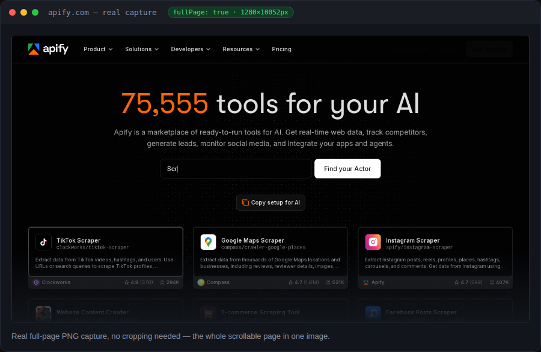
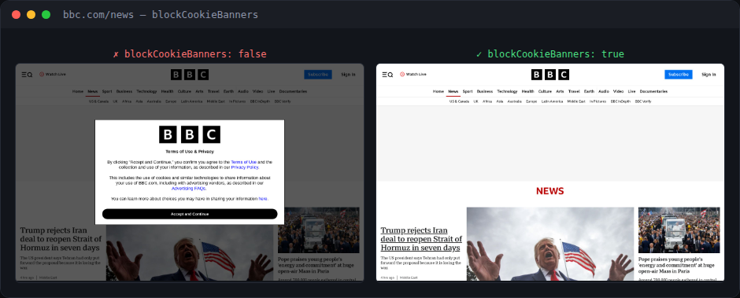
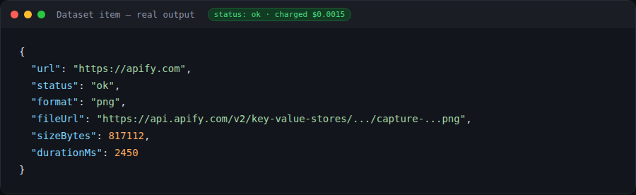

# Pageframe – Website Screenshot & PDF Generator

**▶ [Run it on Apify](https://apify.com/siftwright/pageframe-screenshots)** · Examples: [Python, JavaScript & curl](examples/)

Turn any URL into a **crisp screenshot (PNG/JPEG)** or a **print-ready PDF** in one call. Full-page capture, custom viewports, retina/HiDPI scaling, and best-effort **automatic cookie-banner dismissal** so your images aren't covered by consent popups.

**Price: $0.0015 per successful capture.** Failed pages (timeouts, 4xx/5xx, DNS errors) are never charged.





## Why choose Pageframe

| | Pageframe |
|---|---|
| 💵 **Price** | **$1.50 per 1,000 captures**, no monthly rental |
| 🛡️ **Pay only for success** | Timeouts, DNS errors and 4xx/5xx pages cost **$0** |
| 🍪 **Clean shots** | Cookie & consent banners dismissed automatically before capture |
| 📄 **Screenshots *and* PDFs** | PNG, JPEG or print-ready PDF (A4, A3, Letter, Legal) |
| 🔍 **Retina quality** | 2x / 3x device scale for crisp images on any screen |
| ⚙️ **Real browser** | Chromium renders React, Vue & Next.js pages correctly |
| 🤖 **AI-agent ready** | Callable from Claude, ChatGPT & Cursor through Apify's MCP server |

## What you can use it for

- 🖼️ **Visual monitoring** – track how competitor or client pages look over time.
- 📄 **PDF generation** – invoices, reports, articles or landing pages as clean PDFs.
- 🔗 **Link previews & thumbnails** – generate real preview images for a directory or dashboard.
- 🧪 **QA & regression testing** – capture pages before/after a deploy.
- 📚 **Archiving** – keep a visual record of a page as it existed on a given date.

## Features

- ✅ **PNG, JPEG or PDF** output, chosen per run
- ✅ **Full-page** or viewport-only capture
- ✅ Custom **viewport size** and **device scale factor** (2x/3x for retina)
- ✅ **PDF page size** control (A4, A3, Letter, Legal)
- ✅ Best-effort **cookie-banner auto-dismiss** (OneTrust, Cookiebot, common "Accept all" buttons)
- ✅ Optional **wait-for-selector** and **extra delay** for slow/animated pages
- ✅ Failed captures are **never charged**
- ✅ Runs on a real Chromium browser (Playwright) — renders JS-heavy pages correctly

## How to use

1. Open the tool on Apify: https://apify.com/siftwright/pageframe-screenshots and click **Try for free**.
2. Paste one or more URLs into **URLs to capture**.
3. Pick a **format** (png / jpeg / pdf) and adjust viewport / scale if you want retina output.
4. Click **Start** and open the **Output** tab — each row links directly to the image or PDF file.

## Input example

```json
{
  "urls": ["https://apify.com", "https://en.wikipedia.org/wiki/Web_scraping"],
  "format": "png",
  "fullPage": true,
  "deviceScaleFactor": 2,
  "blockCookieBanners": true
}
```

| Field | Description |
|---|---|
| `urls` | One or more page URLs to capture |
| `format` | `png`, `jpeg` or `pdf` |
| `fullPage` | Capture the whole scrollable page (image formats only) |
| `viewportWidth` / `viewportHeight` | Browser viewport size in pixels |
| `deviceScaleFactor` | 1 (default), 2 or 3 for retina/HiDPI |
| `pdfPageFormat` | `A4`, `A3`, `Letter` or `Legal` (PDF only) |
| `blockCookieBanners` | Best-effort auto-click common cookie "Accept" buttons first |
| `waitForSelector` | CSS selector to wait for before capturing |
| `delaySec` | Extra fixed wait (seconds) before capturing |

## Output example

```json
{
  "url": "https://apify.com",
  "status": "ok",
  "format": "png",
  "fileUrl": "https://api.apify.com/v2/key-value-stores/.../records/capture-....png",
  "sizeBytes": 812345,
  "durationMs": 2140
}
```

Failed pages are returned with `"status": "error"` and an `error` message, and are never charged.

## Pricing

Pay-per-event: **$0.0015 per successfully captured page** (image or PDF). No monthly rental, no charge for failed pages. Apify's free plan gives you monthly credits so you can try it for free.

## Quick start in Python

```python
from apify_client import ApifyClient

client = ApifyClient("YOUR_APIFY_TOKEN")
run = client.actor("siftwright/pageframe-screenshots").call(run_input={
    "urls": ["https://apify.com"],
    "format": "png",
    "fullPage": True,
    "deviceScaleFactor": 2,
})
for item in client.dataset(run["defaultDatasetId"]).iterate_items():
    print(item["url"], item["status"], item.get("fileUrl"))
```

## Use it via API

```bash
curl -X POST "https://api.apify.com/v2/acts/siftwright~pageframe-screenshots/run-sync-get-dataset-items?token=YOUR_TOKEN" \
  -H "Content-Type: application/json" \
  -d '{"urls":["https://apify.com"],"format":"png"}'
```

Works with Python and JavaScript API clients, Make, Zapier and n8n. **AI agents** (Claude, ChatGPT, Cursor) can call it directly through [Apify's MCP server](https://mcp.apify.com).

## FAQ

**Does it work on JavaScript-heavy sites?** Yes — it renders with a real Chromium browser (Playwright), so React/Vue/Next.js pages capture correctly, not just static HTML.

**Can I get a transparent background or a specific element only?** Not in v1 — this version captures the full page or viewport. Element-only capture and transparent backgrounds are on the roadmap.

**Why wasn't I charged for a page?** Timeouts, DNS failures and HTTP 4xx/5xx responses are never charged — you only pay for a page that actually rendered and was captured.

**Something broke or you need a feature?** Open an issue in this repository's **Issues** tab — we respond fast.
