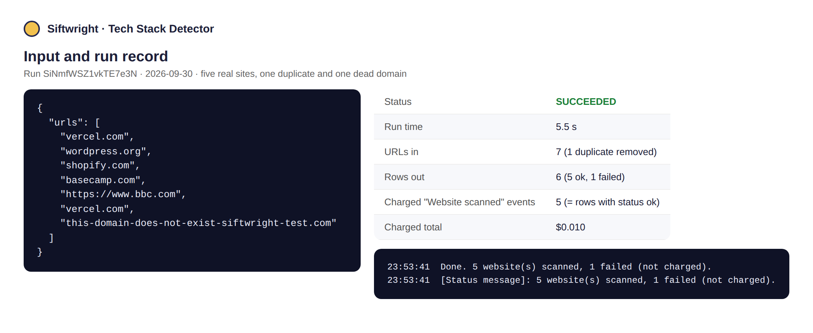
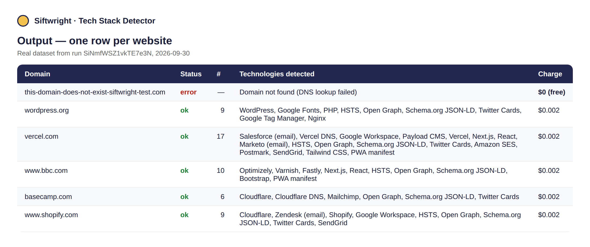
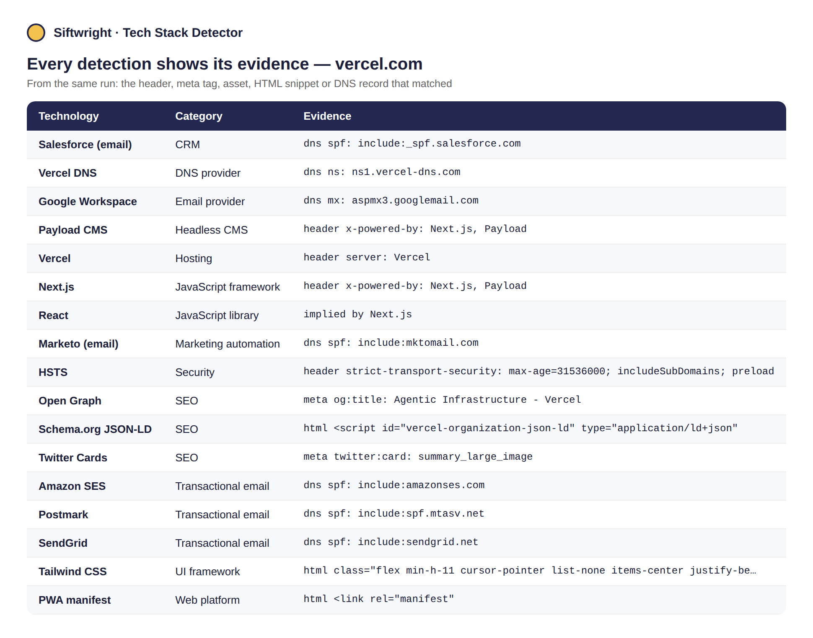

# Tech Stack Detector

**▶ [Run it on Apify](https://apify.com/siftwright/tech-stack-detector)** · Examples: [Python, JavaScript & curl](examples/) · Product page: [siftwright.com/tech-stack-detector/](https://siftwright.com/tech-stack-detector/)

Find out **what any website is built with**: CMS, ecommerce platform, JavaScript framework, analytics and ad pixels, hosting and CDN, cookie banner, live chat, **email provider and DNS provider**. Paste domains, get one clean JSON row per website — and **every detection comes with the evidence** that proves it (the header, meta tag, script, HTML snippet or DNS record that matched).

**Price: $2 per 1,000 websites ($0.002 each).** Websites that fail to load, time out or don't exist are **free**. Duplicates in your list are removed before scanning.





*Screenshots are rendered from a real test run on 2026-09-30 (run input, dataset and run record), not mock-ups.*

## Why use this detector

| | |
|---|---|
| 💵 **Price** | **$2 per 1,000 websites**, no monthly rental |
| 🛡️ **Pay only for success** | Dead domains, timeouts and invalid URLs cost **$0** |
| 🔍 **Evidence, not guesses** | Each technology lists what matched, e.g. `header server: Vercel` or `dns mx: aspmx.l.google.com` — easy to verify and to trust |
| 📬 **Email & DNS stack included** | MX, SPF and NS records reveal Google Workspace / Microsoft 365, SendGrid / Amazon SES / Postmark, Cloudflare / Route 53 — no extra charge |
| 🏷️ **Versions where visible** | e.g. WordPress, Drupal, Nginx, jQuery versions when the site exposes them |
| ⚡ **Fast** | Plain HTTPS and DNS, no browser: 5 sites in about 5 seconds in our test |
| 🤖 **AI-agent ready** | Callable from Claude, ChatGPT & Cursor through Apify's MCP server |

## What it detects (about 200 fingerprints)

- **CMS & site builders:** WordPress (+ WooCommerce, Elementor, Yoast), Drupal, Joomla, Ghost, Wix, Squarespace, Webflow, Framer, HubSpot CMS, Contentful, Sanity, Payload, Hugo, Docusaurus…
- **Ecommerce & payments:** Shopify, Magento, BigCommerce, PrestaShop, Salesforce Commerce Cloud, Stripe, PayPal, Klarna, Paddle, Lemon Squeezy…
- **Frameworks & libraries:** Next.js, Nuxt, Gatsby, Remix, Astro, SvelteKit, Angular, React, Vue, jQuery, Bootstrap, Tailwind CSS…
- **Analytics, tags & ads:** Google Analytics, Google Tag Manager, Segment, Mixpanel, Amplitude, PostHog, Plausible, Hotjar, Clarity, Meta Pixel, LinkedIn Insight, TikTok Pixel…
- **Marketing & support:** HubSpot, Marketo, Pardot, Klaviyo, Mailchimp, Intercom, Zendesk, Drift, Crisp…
- **Hosting & CDN:** Cloudflare, Vercel, Netlify, AWS CloudFront, Fastly, Akamai, Azure, Google Cloud, Nginx, Apache, IIS…
- **Security & consent:** reCAPTCHA, hCaptcha, Turnstile, OneTrust, Cookiebot, HSTS, Sentry…
- **Email & DNS (from DNS records):** Google Workspace, Microsoft 365, Zoho, Proton, Mimecast, Proofpoint, SendGrid, Amazon SES, Mailgun, Postmark, Cloudflare DNS, Route 53…

## What you can use it for

- 🎯 **Lead generation & sales targeting** – find every Shopify store or HubSpot user in your prospect list, then pitch what fits their stack.
- 🧭 **Competitor research** – see which analytics, A/B testing and marketing tools competitors run.
- 🧹 **CRM enrichment** – add "CMS", "Ecommerce platform" and "Email provider" columns to your accounts.
- 🔐 **Security & compliance audits** – check a portfolio of sites for HSTS, consent managers and outdated libraries.
- 🤝 **Agencies & partners** – qualify leads by platform (e.g. WordPress or Webflow sites only).

## How to use

1. Click **Try for free**.
2. Paste domains or URLs into **Websites** (e.g. `stripe.com`).
3. Click **Start** and download the results from the **Output** tab as JSON, CSV or Excel.

## Input example

```json
{
  "urls": ["vercel.com", "wordpress.org", "shopify.com"],
  "includeDns": true
}
```

| Field | Description |
|---|---|
| `urls` | Domains or URLs to scan; the page you give is scanned (usually the homepage) |
| `includeDns` | Also read MX, SPF and NS records to detect email and DNS providers (default `true`, no extra charge) |
| `timeoutSecs` | Per-website timeout, 5–60 seconds (default 20) |
| `maxConcurrency` | Websites scanned in parallel (default 10) |

## Output example

A real row from a test run on 2026-09-30 (shortened):

```json
{
  "domain": "wordpress.org",
  "status": "ok",
  "httpStatus": 200,
  "title": "Blog Tool, Publishing Platform, and CMS – WordPress.org",
  "generator": "WordPress 7.2-alpha-64027",
  "technologyCount": 9,
  "technologyNames": [
    "WordPress",
    "Google Fonts",
    "PHP",
    "HSTS",
    "Open Graph",
    "Schema.org JSON-LD",
    "Twitter Cards",
    "Google Tag Manager",
    "Nginx"
  ],
  "byCategory": {
    "CMS": [
      "WordPress"
    ],
    "Font": [
      "Google Fonts"
    ],
    "Programming language": [
      "PHP"
    ],
    "Security": [
      "HSTS"
    ]
  },
  "technologies": [
    {
      "name": "WordPress",
      "categories": [
        "CMS"
      ],
      "version": "7.2",
      "evidence": [
        "meta generator: WordPress 7.2-alpha-64027",
        "asset https://wordpress.org/wp-content/mu-plugins/pub-sync/blocks/language-suggest/build/front.…"
      ]
    },
    {
      "name": "Nginx",
      "categories": [
        "Web server"
      ],
      "version": null,
      "evidence": [
        "header server: nginx"
      ]
    }
  ]
}
```

Also included: `byCategory` for every category, the `dns` records used, `finalUrl` after redirects and the page `title`. Websites that fail return `"status": "error"` with a readable `error` (e.g. `Domain not found (DNS lookup failed)`) and are **not charged**.

## Limits you should know about

- It scans **one page per website** (the URL you give) over plain HTTPS, **without running JavaScript**. Tools that are only loaded later by JavaScript or a tag manager can be missed, and sites behind a bot challenge may return less.
- About 200 fingerprints: fewer than Wappalyzer's or BuiltWith's catalogues. It covers the technologies most people ask about, and each result is evidence-based rather than a guess.
- Email tools found in **SPF records** are services the domain *authorises to send email*, not proof they are used today.
- It detects live technology only; it has **no history** of what a site used in the past.

## Pricing

Pay-per-event: **$0.002 per website scanned** (= $2 per 1,000). Failed websites and duplicates are free, and runs respect your *maximum cost per run* setting exactly. Apify's free plan includes monthly credits, so you can try it at no cost.

## Quick start in Python

```python
from apify_client import ApifyClient

client = ApifyClient("YOUR_APIFY_TOKEN")
run = client.actor("siftwright/tech-stack-detector").call(run_input={
    "urls": ["vercel.com", "wordpress.org", "shopify.com"],
})
# apify-client 3.x (pip install apify-client); on 2.x use run["defaultDatasetId"]
for item in client.dataset(run.default_dataset_id).iterate_items():
    print(item["domain"], item.get("byCategory") or item.get("error"))
```

## Use it via API

```bash
curl -X POST "https://api.apify.com/v2/acts/siftwright~tech-stack-detector/run-sync-get-dataset-items?token=YOUR_TOKEN" \
  -H "Content-Type: application/json" \
  -d '{"urls":["vercel.com","shopify.com"]}'
```

Works with Python and JavaScript API clients, Make, Zapier, n8n, LangChain and LlamaIndex. **AI agents** (Claude, ChatGPT, Cursor) can call it directly through [Apify's MCP server](https://mcp.apify.com).

## FAQ

**How is this different from Wappalyzer or BuiltWith?** Those have larger catalogues and (BuiltWith) historical data. This detector checks the live site and DNS right now, shows the evidence for every match, adds the email/DNS stack, and costs $2 per 1,000 websites with failures free.

**Why was a technology I know the site uses not detected?** Most often it is loaded only by JavaScript after the page renders, or it's on a different page than the one scanned. Try the exact page URL, and tell us on the **Issues** tab — we add fingerprints quickly.

**Can I scan thousands of sites?** Yes. Raise `maxConcurrency` for large lists; set a *maximum cost per run* if you want a hard budget — the run stops exactly there.

**Is it legal?** It reads the same public page and DNS records any browser or mail server sees. Use the results in line with applicable law and the sites' terms.

**Something broke or you need a feature?** Open an issue on the **Issues** tab or email support@siftwright.com.
