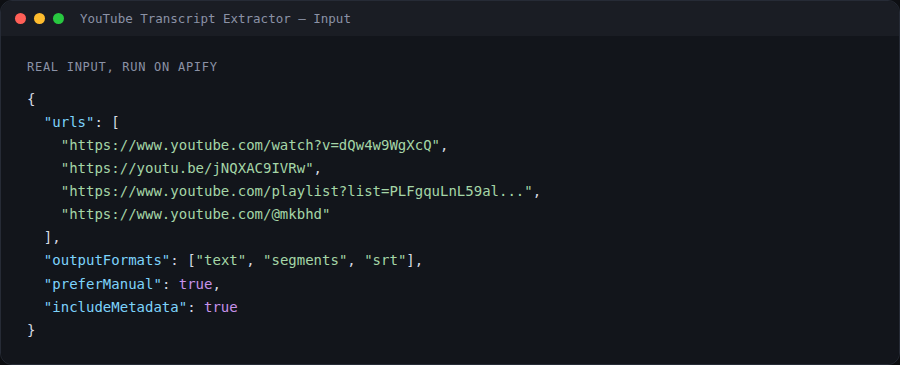
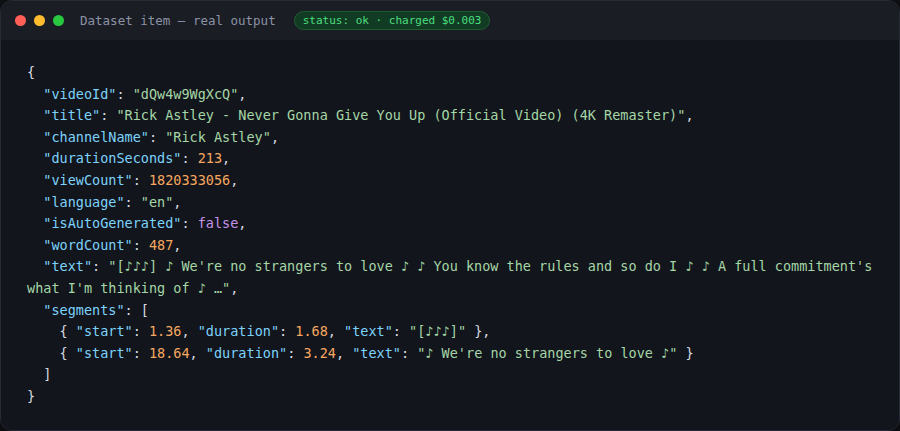
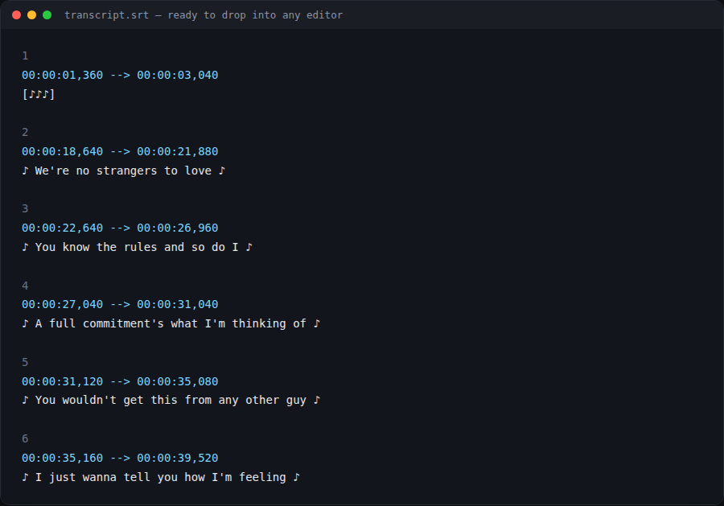

# YouTube Transcript Extractor

**▶ [Run it on Apify](https://apify.com/siftwright/youtube-transcript-extractor)** · Examples: [Python, JavaScript & curl](examples/)

Get the **transcript (captions / subtitles) of any YouTube video** in seconds — as plain text, timestamped JSON segments, **SRT** or **WebVTT**. Paste video links, Shorts, whole **playlists** or entire **channels**, pick a language (or auto-translate), and download the results as JSON, CSV, Excel or via API.

**Price: $3 per 1,000 transcripts ($0.003 each).** You only pay for transcripts that are actually extracted — videos without captions, private videos and errors are **free**. Video metadata is included at no extra charge.





## Why teams choose this extractor

| | This Actor |
|---|---|
| 💵 **Price** | **$3 per 1,000 transcripts**, no monthly rental |
| 🛡️ **Pay only for success** | Caption-less, private and failed videos cost **$0** (some tools bill every result row, even failures) |
| 🎁 **Free extras** | Title, channel, views, duration, publish date and available languages at no extra charge |
| 📦 **Every format in one run** | Plain text, timestamped JSON, **SRT** and **VTT** |
| 🌍 **Any language** | Pick a language or auto-translate into 100+ languages |
| ⚡ **Bulk-ready** | Whole playlists and channels, processed in parallel |
| 🤖 **AI-agent ready** | Callable from Claude, ChatGPT & Cursor through Apify's MCP server |

## What you can use it for

- 🤖 **AI & RAG pipelines** – feed clean transcript text into ChatGPT, Claude, LangChain, LlamaIndex or a vector database.
- 📝 **Content repurposing** – turn videos into blog posts, newsletters, social posts and show notes.
- 🔍 **Research & SEO** – analyze what competitors and creators say, find keywords, quotes and topics at scale.
- 🎓 **Education & accessibility** – study notes, summaries and subtitle files (SRT/VTT) for editors.
- 📊 **Media monitoring** – track mentions of brands, products or people across channels.

## Features

- ✅ Videos, **Shorts**, live replays, **playlists** and **channels** (`/@handle`, `/channel/UC…`, bare video IDs)
- ✅ Human-made captions preferred, automatic fallback to **auto-generated** captions
- ✅ **Any language** + **auto-translate** into 100+ languages via YouTube's built-in translation
- ✅ Output as **plain text**, **timestamped segments**, **SRT** and **VTT**
- ✅ Free **metadata**: title, channel, duration, views, publish date, description, keywords, thumbnail
- ✅ Lists the languages available for every video
- ✅ Fast & lightweight (no browser), parallel processing, automatic rate-limit handling
- ✅ Failed / caption-less videos are never charged

## How to use

1. Open the tool on Apify: https://apify.com/siftwright/youtube-transcript-extractor and click **Try for free**.
2. Paste one or more YouTube URLs into **YouTube URLs or IDs**.
3. (Optional) choose a language, translation and output formats.
4. Click **Start** and download your transcripts from the **Output** tab.

## Input example

```json
{
  "urls": [
    "https://www.youtube.com/watch?v=dQw4w9WgXcQ",
    "https://youtu.be/jNQXAC9IVRw",
    "https://www.youtube.com/playlist?list=PLFgquLnL59alCl_2TQvOiD5Vgm1hCaGSI",
    "https://www.youtube.com/@mkbhd"
  ],
  "language": "en",
  "translateTo": "",
  "outputFormats": ["text", "segments", "srt"],
  "maxVideosPerSource": 20
}
```

| Field | Description |
|---|---|
| `urls` | Video / Shorts / playlist / channel URLs or bare video IDs |
| `language` | Preferred language codes in order, e.g. `en` or `es,en` |
| `translateTo` | Translate the transcript into this language code, e.g. `de` |
| `preferManual` | Prefer creator-uploaded captions over auto-generated (default `true`) |
| `outputFormats` | Any of `text`, `segments`, `srt`, `vtt` |
| `includeMetadata` | Include free video metadata (default `true`) |
| `maxVideosPerSource` | Max videos taken from each playlist or channel (newest first) |

## Output example

```json
{
  "videoId": "dQw4w9WgXcQ",
  "url": "https://www.youtube.com/watch?v=dQw4w9WgXcQ",
  "status": "ok",
  "title": "Rick Astley - Never Gonna Give You Up (Official Video) (4K Remaster)",
  "channelName": "Rick Astley",
  "durationSeconds": 213,
  "viewCount": 1700000000,
  "publishDate": "2009-10-24",
  "language": "en",
  "isAutoGenerated": false,
  "isTranslated": false,
  "availableLanguages": [{ "code": "en", "name": "English", "autoGenerated": false }],
  "wordCount": 487,
  "text": "♪ We're no strangers to love ♪ ♪ You know the rules and so do I ♪ …",
  "segments": [
    { "start": 18.64, "duration": 3.24, "text": "♪ We're no strangers to love ♪" }
  ],
  "srt": "1\n00:00:18,640 --> 00:00:21,880\n♪ We're no strangers to love ♪\n…"
}
```

Videos without a transcript are returned with `"status": "no_transcript"` and an `error` message (and are not charged), so you always know what happened to every input.

## Pricing

Pay-per-event: **$0.003 per extracted transcript** (= $3 per 1,000). No monthly rental, no charge for failed videos, playlists/channel listing or metadata. Apify's free plan gives you monthly credits so you can try it for free.

## Quick start in Python

```python
from apify_client import ApifyClient

client = ApifyClient("YOUR_APIFY_TOKEN")
run = client.actor("siftwright/youtube-transcript-extractor").call(run_input={
    "urls": ["https://www.youtube.com/watch?v=dQw4w9WgXcQ"],
    "outputFormats": ["text", "srt"],
})
for item in client.dataset(run["defaultDatasetId"]).iterate_items():
    print(item["title"], item["wordCount"], "words")
```

## Use it via API

```bash
curl -X POST "https://api.apify.com/v2/acts/siftwright~youtube-transcript-extractor/run-sync-get-dataset-items?token=YOUR_TOKEN" \
  -H "Content-Type: application/json" \
  -d '{"urls":["https://www.youtube.com/watch?v=dQw4w9WgXcQ"],"outputFormats":["text"]}'
```

Works with Python and JavaScript API clients, Make, Zapier, n8n, LangChain and LlamaIndex. **AI agents** (Claude, ChatGPT, Cursor) can call it directly through [Apify's MCP server](https://mcp.apify.com).

## FAQ

**Does it work for videos without captions?** It can only return transcripts that exist on YouTube (creator-made or auto-generated). Videos with captions disabled are reported as `no_transcript` and are free.

**Is it legal?** The Actor only reads publicly available caption data. Make sure your use respects YouTube's terms and applicable copyright law.

**Something broke or you need a feature?** Open an issue in this repository's **Issues** tab — we respond fast.
